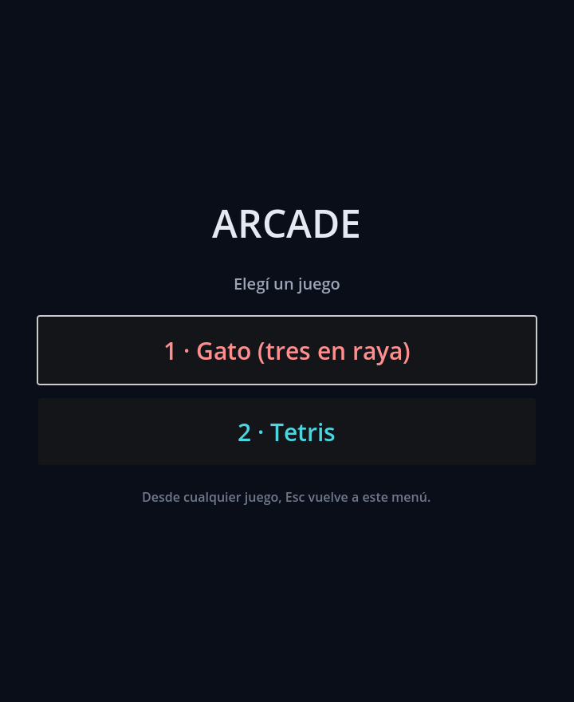
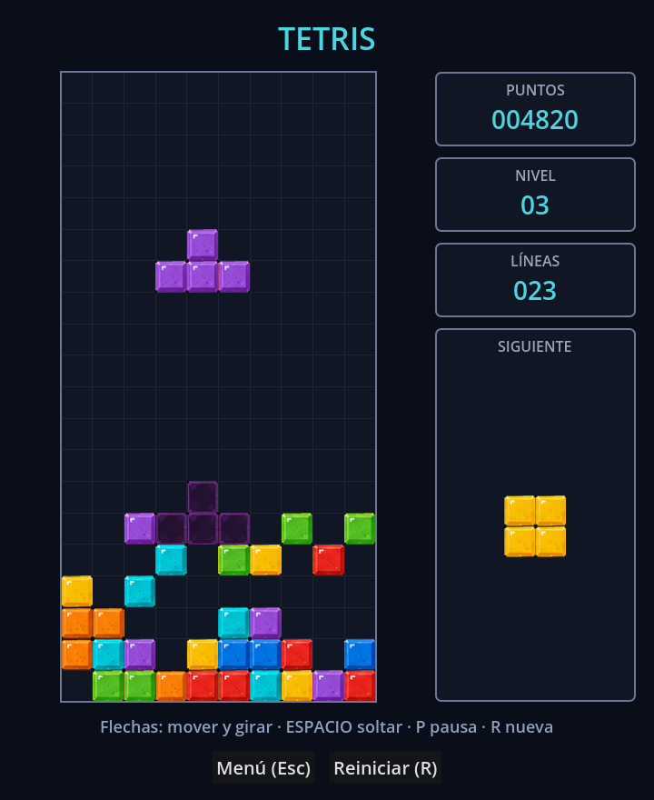
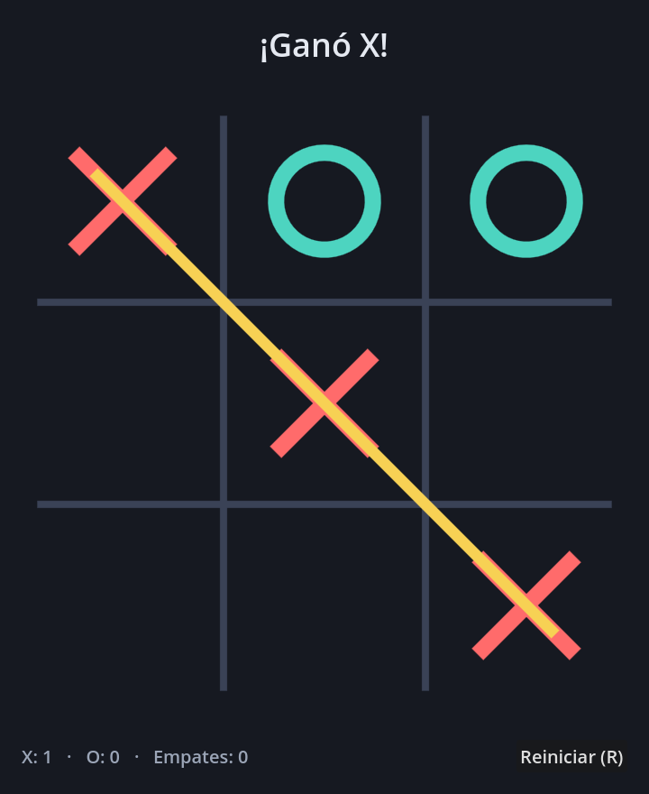

# Arcade (Gato + Tetris) — Godot 4

**Jugar: https://eliascordova-softseti.github.io/tests/**

Dos juegos en un mismo proyecto, con un menú para elegir cuál abrir:

- **Gato** (tres en raya) para dos jugadores en local. El tablero se dibuja
  entero desde código con `_draw()`, sin assets.
- **Tetris** clásico de 10x20, con los sprites de `assets/tetris/blocks.png`.

| Menú | Tetris | Gato |
| --- | --- | --- |
|  |  |  |

## Requisitos

- Godot **4.x** (probado con 4.2.2 estable). No hace falta nada más.

## Cómo jugar

1. Abrí el proyecto en Godot (`Importar` → elegir `project.godot`).
2. Ejecutá con **F5**: arranca el menú.
3. Elegí con el mouse o con **1** (gato) y **2** (tetris). **Esc** vuelve al menú
   desde cualquiera de los dos.

### Gato

Clic en una casilla para poner tu marca. X siempre empieza. **R** o *Reiniciar*
empieza una partida nueva; el marcador acumulado (X / O / empates) se conserva.

### Tetris

| Tecla | Qué hace |
| --- | --- |
| ← → (o A / D) | Mover la pieza |
| ↑ (o W / X) / Z | Girar en sentido horario / antihorario |
| ↓ (o S) | Bajar un casillero (suma 1 punto) |
| Espacio o Enter | Soltar la pieza de una (2 puntos por casillero) |
| P | Pausa |
| R | Partida nueva |
| Esc | Volver al menú |

Mantener ← → ↓ repite el movimiento. Se ve la sombra de dónde va a caer la
pieza y cuál es la siguiente. Una línea vale 100 puntos, dos 300, tres 500 y un
tetris (cuatro) 800, todo multiplicado por el nivel; cada 10 líneas sube el
nivel y las piezas caen más rápido. Las piezas salen de una bolsa de 7
barajada, así que no se repiten cinco S seguidas.

En pantallas táctiles aparece una fila de botones (Izq / Girar / Der / Baja /
Soltar) debajo del tablero; en escritorio queda oculta. Cambiar de pestaña
pausa la partida.

Los textos de la interfaz no usan flechas ni símbolos raros: la fuente que
Godot empaqueta en el export web no los trae y saldrían como cuadraditos.

## Estructura

| Archivo | Qué hace |
| --- | --- |
| `project.godot` | Configuración: escena principal (el menú), tamaño de ventana, renderer. |
| `scenes/Menu.tscn`, `scripts/Menu.gd` | Menú de arranque; cada botón cambia de escena. |
| `scenes/Main.tscn`, `scripts/Main.gd` | Pantalla del gato: turno, marcador y botones. |
| `scripts/Board.gd` | Estado del gato (`GatoBoard`), detección de ganador, input y dibujado. |
| `scenes/Tetris.tscn`, `scripts/TetrisMain.gd` | Pantalla del tetris: teclado, reloj y panel. |
| `scripts/Tetris.gd` | Reglas del tetris (`TetrisGame`): grilla, piezas, líneas, puntaje. |
| `scripts/TetrisView.gd` | Dibuja el pozo, las piezas y la sombra con el atlas de sprites. |
| `scripts/TetrisPreview.gd` | Recuadro "SIGUIENTE". |
| `assets/tetris/blocks.png` | Atlas 224x64: 7 bloques de 32x32 y sus versiones apagadas. |
| `tests/test_board.gd`, `tests/test_tetris.gd` | Pruebas de la lógica, sin abrir ventana. |

En los dos juegos la lógica no sabe nada de la interfaz. `GatoBoard` expone las
señales `move_made` y `game_finished`. `TetrisGame` es un `RefCounted` puro —se
instancia sin escena— con `lines_cleared`, `piece_locked`, `level_changed` y
`game_over`, y todo el estado en `grid`, `piece`, `next_piece`, `score`,
`lines`, `level` e `is_over`. Poner una IA que juegue al tetris es escribir algo
que llame a `move()`, `rotate()` y `hard_drop()`.

### Los sprites

`docs/tetris_sprites.png` es la hoja de referencia original. De ahí se
recortaron los siete bloques de la fila "BLOQUES" y sus versiones apagadas de
"COLORES FANTASMA", escalados a 32x32 y pegados en `assets/tetris/blocks.png`:
la fila de arriba son los bloques y la de abajo las sombras. La columna del
atlas es `pieza - 1`, con el mismo orden que las constantes de `TetrisGame`
(I, J, L, O, S, Z, T → cian, azul, naranja, amarillo, verde, rojo, violeta).
La hoja de referencia queda fuera del export (`exclude_filter`), que sólo se
lleva el atlas.

## Exportar a web

El preset `Web` de `export_presets.cfg` ya esta configurado. Con las plantillas
de exportacion de Godot instaladas:

```bash
godot --headless --path . --export-release "Web" build/web/index.html
```

Dos detalles que hacen que funcione en un servidor estatico cualquiera:

- Godot 4 necesita **aislamiento cross-origin** (`SharedArrayBuffer`). Si el
  servidor no manda `Cross-Origin-Opener-Policy` y `Cross-Origin-Embedder-Policy`,
  el juego no arranca. GitHub Pages no las manda.
- Por eso el preset inyecta `coi-serviceworker.js` via `html/head_include`: un
  service worker que agrega esas cabeceras del lado del cliente. Hay que copiar
  ese archivo junto al export.

### Publicacion automatica

`.github/workflows/deploy-web.yml` corre en cada push a cualquier rama: prueba
los dos juegos, exporta a web y sube el resultado como artefacto. Cachea Godot
para no bajar ~900 MB de plantillas en cada corrida.

El job `deploy` sólo corre en la **rama por defecto** del repo, porque el
entorno `github-pages` rechaza los deploys que vienen de otra rama (el job se
muere a los dos segundos y sin log). La condición se lee sola de la API
(`github.event.repository.default_branch`), así que no hay que tocar el
workflow si la rama por defecto cambia de nombre.

Pages está habilitado con `Source: GitHub Actions`.

`main` ya existe y tiene todo. Falta un paso que sólo se hace desde la web:
**Settings → General → Default branch → cambiar a `main`**. Después de eso
`main` es la rama que publica, y las ramas viejas se pueden borrar.

Ojo con el peso: el export son ~35 MB, casi todo `index.wasm` (el runtime de
Godot). Los dos juegos juntos son unos 80 KB. Es la primera carga; despues queda
cacheado.

## Pruebas

```bash
godot --headless --path . --script res://tests/test_board.gd
godot --headless --path . --script res://tests/test_tetris.gd
```

Del gato: victorias por fila y diagonal, empate, rechazo de jugadas ilegales y
alternancia de turnos. Del tetris: las 7 piezas y sus rotaciones, los límites
del pozo, la sombra, el borrado de líneas con lo de arriba bajando, el puntaje,
la subida de nivel, la pausa, el game over y la bolsa de 7. Los dos salen con
código 0 si todo pasa.
